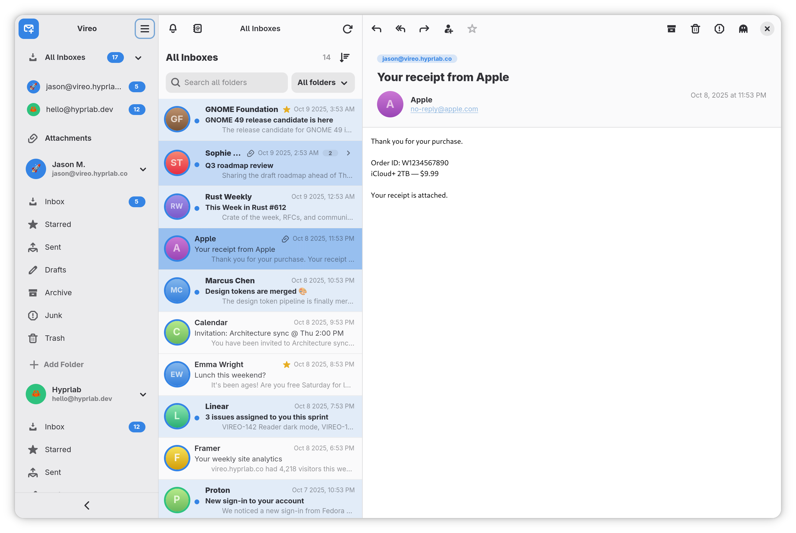

<p align="center">
  
</p>

<h1 align="center">Vireo</h1>

<p align="center">
  A clean, fast, <strong>GNOME-native</strong> email client — built with Rust and libadwaita, privacy-first.
</p>

<p align="center">
  <a href="https://vireo.hyprlab.co">Website</a> ·
  <a href="RELEASE_NOTES.md">Release notes</a> ·
  <a href="https://github.com/hyprlab/vireo/releases">Releases</a>
  <br>
  
</p>

<p align="center">
  
</p>

---

> [!NOTE]
> **Veem is now Vireo.** As of v1.6.0 the app formerly known as Veem has a new
> name and icon — the old name was too easily confused with similarly named
> products. Same app, same code. Native installs migrate your data
> automatically; Flatpak users should [install Vireo fresh](https://vireo.hyprlab.co)
> and remove the old Veem app. getveem.com now redirects here.

Vireo is a desktop email client for Wayland that feels at home in GNOME. It talks
IMAP/SMTP directly, keeps your mail and credentials on your machine, and blocks
trackers by default — no telemetry, no analytics.

## Features

- **Multiple accounts** — IMAP and POP3, each on its own background worker, with a unified *All Inboxes* view.
- **OAuth 2.0 sign-in** — Google, Microsoft and custom providers over XOAUTH2, plus import from GNOME Online Accounts.
- **Whole-mailbox sync & search** — no message-count cap; a fast first page loads instantly, the rest indexes in the background with infinite scroll.
- **Two-way sync** — deletions and moves from your phone or another client sync back automatically (IMAP IDLE + reconciliation).
- **Conversation threading**, compose/reply/forward with HTML signatures, editable drafts, and full folder management.
- **Privacy-first reading** — remote content blocked by default, per-sender allow/block lists, and a per-message light/dark content theme.
- **GNOME-native** — adaptive three-pane layout, per-account colours and emoji avatars, light/dark following the system, optional GNOME Contacts.

See **[RELEASE_NOTES.md](RELEASE_NOTES.md)** for the full list.

## Installing

**Flatpak (recommended)** — works on any distribution; see
[vireo.hyprlab.co](https://vireo.hyprlab.co) for the signed Flatpak repo.
Prefer a direct download? Grab `Vireo-<version>.flatpak` from the
[latest release](https://github.com/hyprlab/vireo/releases/latest) and run
`flatpak install ./Vireo-*.flatpak` — the bundle carries the repo address and
signing key, so it still receives updates from the official repo.

**Fedora** — download the `.rpm` from the
[latest release](https://github.com/hyprlab/vireo/releases/latest) and:

```sh
sudo dnf install ./vireo-*.x86_64.rpm
```

**Arch Linux** — download the `.pkg.tar.zst` from the
[latest release](https://github.com/hyprlab/vireo/releases/latest) and:

```sh
sudo pacman -U ./vireo-*-x86_64.pkg.tar.zst
```

**Debian / Ubuntu** — download the `.deb` (Ubuntu 24.04+, Debian 13+) from the
[latest release](https://github.com/hyprlab/vireo/releases/latest) and:

```sh
sudo apt install ./vireo_*_amd64.deb
```

**Snap** — download the `.snap` from the
[latest release](https://github.com/hyprlab/vireo/releases/latest) and:

```sh
sudo snap install --dangerous ./vireo_*_amd64.snap
```

(`--dangerous` only means "installed from a local file instead of the store".)

You can also build the Arch package yourself with `makepkg` from
[`packaging/arch/PKGBUILD`](packaging/arch/PKGBUILD).

The native packages target current distro releases (Fedora 44+, up-to-date
Arch). On anything older, use the Flatpak or build from source. A Secret
Service provider (e.g. gnome-keyring, preinstalled on GNOME) is needed at
runtime for password storage.

## Building from source

Vireo needs the Rust toolchain and the GTK 4 / libadwaita / WebKitGTK 6
development libraries, plus a Secret Service provider (e.g. gnome-keyring) at
runtime.

**Fedora**

```sh
sudo dnf install gtk4-devel libadwaita-devel webkitgtk6.0-devel
```

**Debian / Ubuntu**

```sh
sudo apt install libgtk-4-dev libadwaita-1-dev libwebkitgtk-6.0-dev
```

**Build & install**

```sh
git clone https://github.com/hyprlab/vireo.git
cd vireo
cargo build --release
./install.sh          # installs the binary, icon and .desktop file into ~/.local
```

## Configuration

Add accounts from **Settings → Accounts** in the app. For a plain IMAP/SMTP
account you only need the server and an app-specific password. See
[`accounts.toml.example`](accounts.toml.example) for the on-disk format —
passwords you enter there are migrated into the system keyring on first run and
removed from the file.

### OAuth (Google / Microsoft)

**Microsoft** works out of the box — pick *Microsoft* in the account editor and
sign in.

**Google** signs in through **GNOME Online Accounts** — add your Google account in
*GNOME Settings → Online Accounts*, then import it in Vireo. Official builds don't
bundle a Google OAuth client (Google's secret can't live in a public repo), so
GNOME Online Accounts is the standard path. You can also use your own OAuth client
(see below).

To use **your own** OAuth client (a fork, a self-hosted build, or to replace the
bundled ones), put it in `~/.config/vireo/oauth.toml`:

```toml
[google]
client_id = "your-client-id.apps.googleusercontent.com"
client_secret = "your-client-secret"

[microsoft]
client_id = "your-azure-application-client-id"  # public client, no secret
```

or via the `VIREO_GOOGLE_CLIENT_ID` / `VIREO_GOOGLE_CLIENT_SECRET` and
`VIREO_MICROSOFT_CLIENT_ID` / `VIREO_MICROSOFT_CLIENT_SECRET` environment variables.

**Bundling a Google client at build time** (for maintainers) — set the env vars
during the build and they're compiled in via `option_env!`:

```sh
VIREO_GOOGLE_CLIENT_ID=... VIREO_GOOGLE_CLIENT_SECRET=... cargo build --release
```

## Privacy

Vireo collects no telemetry and sends no analytics. Remote content in messages is
blocked by default to defeat tracking pixels. Passwords and OAuth refresh tokens
live in the system keyring (secret-service), never in plain files.

## AI notice

Vireo is built by a human maintainer working with generative AI as a
development tool:

- **Code** — the large majority of the Rust code in this repository was written
  with Anthropic's Claude (via Claude Code), working from the maintainer's
  direction. The maintainer decides what gets built, reviews the results, tests
  every release, and signs off on everything that ships.
- **Text** — documentation, release notes, and website copy are largely
  AI-drafted and human-edited.
- **Artwork** — the app icon and other visual assets are human-made, without
  generative AI.
- **The app itself contains no AI.** Vireo has no AI features, makes no
  requests to AI services, and never sends your mail or any other data to one —
  AI was used to *build* the app, not to run it. See [Privacy](#privacy).

Bug reports and pull requests are welcome from humans and their AI tools alike;
everything merged gets the same human review.

## Contact & support

- Website — [vireo.hyprlab.co](https://vireo.hyprlab.co)
- Email — [hyprlab@proton.me](mailto:hyprlab@proton.me)
- [Buy me a coffee](https://buymeacoffee.com/hyprlab) ☕

## License

Vireo is free software licensed under the **GNU Affero General Public License
v3.0 or later** ([AGPL-3.0-or-later](LICENSE)).

© 2026 Hyprlab
